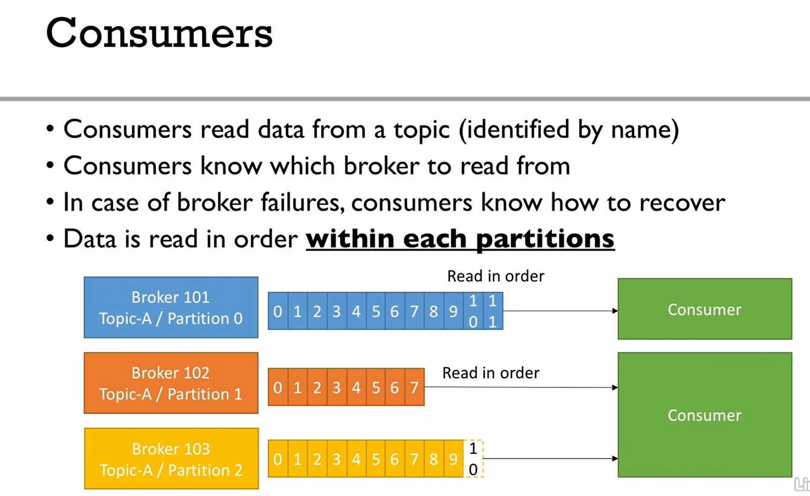

# Apache Kafka
## What is Apache Kafka?
An open source event and message streaming platform.
#### Publishers/Producers
Produce the events/messages
#### Subscribers/Consumers
Consumes the events/messages

## Features:
- Collects messages from various producers concurrently.
- Provides persistent storage for the messages recieved. This provides fault tolence capabilities.
- Tranports data from producers to consumers. With mirroring capabilities it can also tranfer accross networks.
- It can distribute data to multiple cosumers for downstream processing.
- Tracking of message consumption by each consumer. This ensures at least one time delivery of messages, even if the consumers go doen and come back again.

## Use cases
- Messaging System
- Activity Tracker
- Gather metrics from many differnt locations
- Application Logs gathering
- Stream processing (example: with the kafka Streams API or Spark)
- Decouping of system dependencies
- Perfoem Big Data integrartions with Spark, Flink, Strom, Hadoop, and many other BigData technologies.

## Real World Examples
- *NETFLIX* uses kafka to apply recommendations in real-time while you are wathing TV shows
- *UBER* users Kafka to gather user, taxi and trip data in real-time to compute and forecast demand, and compute surge pricing in real-time
- *LINKEDIN* uses Kafka to prevent spam, collect user interactions to make better recommendations in real time.
> In above examples Kafka is only being used as a tranport mechanism.

## Kafka Theory

### Topics, partitions and offsets
- **TOPICS** are basically a particular stream of Data.
- Topics are similar to table in context of Data base (but without any constraints)
- We can have as many topics we want
- A topic is identified by it *name*  
- Topic are split in **PARTITIONS** and each partition can have infinite number of messages and these messages are called **OFFSETS**
- User has to specify the number of partitions to be created while creating the topic. This can be modified later on.

> Each message can be uniquly identified as *kafka_topic.partition.offset*

> Data in Kafka is persisted only for limited amount of time. (Default is 1 week.) But the offsets keep on incrementing they never go back to zero.

#### Data Immutability
Once the data is written inside a partition, we cannot update/modify it.

### Brokers
A kafka cluster is composed of multiple borkers. Each broker behaves as a server. Each broker is identified by its ID(Integer).

Each broker contains certains topic partitions. After connecting to any broker (a bootstrap broker), you will be connected to the cluster.

### Topic Replication Factor
Replication is needed in a distributed system.
Replcation factor for topics should be > 1 (2 or 3). Each topic's partitions should be availble to atleast 2 brokers.

### Concept of Leader for a Partition
- At Anytime only ONE broker can be a leader for a given partition.
- Only that leader can recieve and serve data for partition.
- Other brokers will behave a passive leaders and will synchronise the data
- Therefore each partition has one leader and multiple **ISR** (in-sync replica)

### Producers

#### How producers can write?
Producers can choose to recieve acknowlegdment of data writes:

- acks=0; Producer wont wait for acknowlegdment. This can have possible data loss. Suppose broker is down then producer wont know about it.
- acks=1; (default) Producer will wait for the leader broker's acknowlegdment. This can have limited data loss.
- acks=all; Leader and replicas should send acknowlegdment. (No data loss)

### Message Keys
Producers can choose to send a key with a message(String, number, etc). If key=null, data is sent round robin(1st broker, then 2nd broker then 3rd broker...)

If key is sent then all the messages for that key will always go to the same partition.

### Consumers

### Consumer Offsets

### Kafka Broker Discovery

### Zookeeper

### Kafka Guarantees

